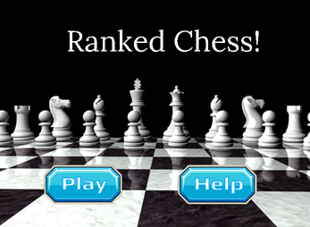
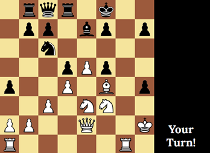
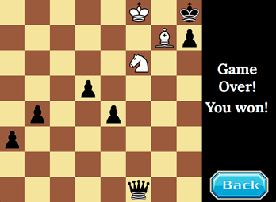
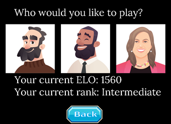

# Ranked Chess

Play against Chess engines with a rating system.

## Features
- Three different chess AI opponents to play against
- Ranking system based on player performance
- Data saving

## Demo










## Installation
### Requirements
- Python 3.0+
- Pygame

### Setup
Install Pygame using pip:
```sh
pip install pygame
```

## Notes
- The strongest AI can take a long time to play a move, which may cause the pygame window to display "Not Responding." If this happens, simply wait for the AI to make a move, and the warning should disappear.
